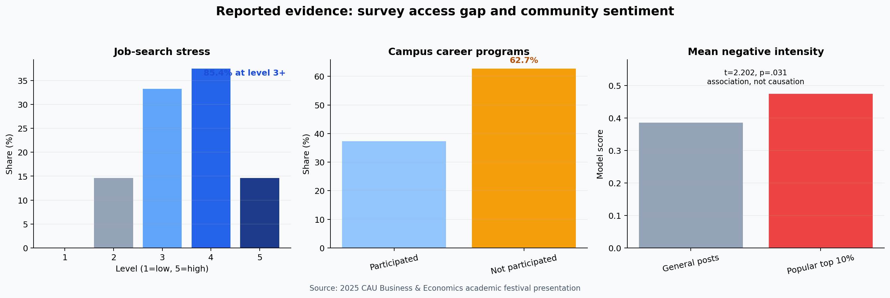
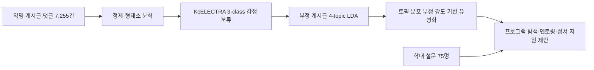

# 취업 준비 과정의 감정 데이터 분석과 지원 제도 설계

에브리타임 취업·진로 게시글 7,255건과 중앙대학교 경영경제대학 재학생 설문을 결합해 **학생들이 언제, 무엇 때문에 어려움을 느끼는지** 분석하고 맞춤형 취업 지원 방안을 제안한 텍스트 마이닝 프로젝트입니다.

> 중앙대학교 경영경제대학 학술제 장려상 수상 · 2025년 4인 팀 프로젝트

## 프로젝트 한눈에 보기

| 항목 | 내용 |
|---|---|
| 의사결정 문제 | 취업 지원 프로그램이 존재해도 학생이 체감하지 못하는 간극을 어떻게 줄일 것인가? |
| 데이터 | 2024년 5월–2025년 5월 익명 게시글 7,255건 · 학내 설문 75명 |
| 분석 | 한국어 전처리 · KcELECTRA 감정 분류 · LDA 토픽 모델링 · K-means 유형화 · 가설검정 |
| 산출물 | [대표 분석 노트북](./notebooks/portfolio_summary.ipynb) · [학술제 발표자료](./reports/구해줘_잡스.pdf) · [원페이지 보고서](./reports/원페이지_보고서.pdf) |
| 성과 | 중앙대학교 경영경제대학 학술제 장려상 |
| 본인 역할 | EDA · 데이터 전처리 · 모델링, 팀 기여도 40% |

## 핵심 발견과 제안

| 관측 결과 | 해석 | 제안 액션 |
|---|---|---|
| 스트레스 문항 응답의 **85.4%가 3점 이상** | 취업 준비 부담이 일부 극단 응답에만 한정되지 않음 | 정보 제공과 정서 지원을 취업 프로그램의 공통 진입점으로 배치 |
| 설문 응답자의 **62.7%가 교내 취업 프로그램 미참여** | 프로그램 보유 여부보다 발견·신청 과정의 접근성이 중요 | 모바일 중심 탐색, 시기별 알림, 개인별 프로그램 로드맵 제공 |
| 부정 게시글 수가 **9–11월에 정점**, 2–5월에 재상승 | 공채·인턴 준비 일정과 정서 부담이 함께 움직이는 계절 패턴 | 정점이 오기 전 상담·멘토링·서류 지원 프로그램을 선제 노출 |
| 인기 상위 10% 글의 평균 부정 강도 **0.475**, 일반 글 **0.386** | 부정적 고민 글이 더 많은 반응을 얻는 연관성이 관측됨 | 반응이 큰 고민 주제를 익명 수요 신호로 활용하되 개인 진단에는 사용하지 않음 |
| 부정 게시글에서 4개 고민 토픽과 지원 유형 도출 | 같은 ‘취업 스트레스’ 안에서도 필요한 지원이 다름 | 불안·경쟁·피로·준비 좌절에 맞춘 프로그램 탐색 경로 제공 |



위 수치는 공개 발표자료의 집계 결과입니다. 월별 결과는 전체 게시량으로 나눈 비율이 아니라 **부정 게시글 수**이므로, 특정 시기에 부정 정서의 확률이 증가했다고 단정하지 않습니다. 인기 글 비교도 관찰적 연관성이며 인과효과가 아닙니다.

## 분석 흐름



### 1. 익명 텍스트를 분석 가능한 형태로 변환

중복·삭제·광고성·공백 게시글을 제외하고 띄어쓰기 보정, Mecab 형태소 분석, 불용어 제거, 복합어 병합을 수행했습니다. 감정 분류용 문자열과 토픽 모델링용 주요 품사 토큰을 분리해 만들었습니다.

원문에는 개인이 작성한 익명 텍스트가 포함되므로 저장소에는 게시글과 설문 원본을 공개하지 않습니다. 발표자료에 사용된 문장도 실제 게시글이 아닌 재구성 예시입니다.

### 2. KcELECTRA로 긍정·중립·부정을 분류

대표 샘플 약 700건을 수동 라벨링하고 `beomi/KcELECTRA-base-v2022`를 3개 클래스로 파인튜닝했습니다. 저장된 노트북에서는 중복·결측 제거 후 672건을 학습 537건, 검증 135건으로 층화 분할했습니다.

공개 산출물에 남은 최선의 검증 loss는 3 epoch의 `0.600`입니다. Accuracy·Macro-F1·클래스별 재현율과 confusion matrix는 저장되어 있지 않으므로, 이 저장소에서는 감정 분류기의 성능 수치를 새로 추정하거나 과장하지 않습니다. 평가 범위는 [분석 근거와 해석 기준](./reports/ANALYSIS_EVIDENCE.md)에 정리했습니다.

### 3. 부정 게시글의 고민 주제를 4개 토픽으로 정리

최종 발표에 사용한 LDA 4토픽은 다음과 같습니다.

| 토픽 | 주요 키워드 | 지원 관점의 해석 |
|---|---|---|
| 채용 절차 부담 | 면접·준비·서류·인적성 | 반복되는 지원 과정과 평가 기준의 불확실성 |
| 직무·기업 선택 | 취업·기업·신입·직무 | 지원 방향과 타인 비교에서 오는 조급함 |
| 조건·경로 불안 | 기업·연봉·공기업·지역 | 취업 이후 삶과 경로에 대한 불확실성 |
| 경험·스펙 부족 | 인턴·경험·스펙·직무 | 준비 자원의 부족과 반복 탈락에서 오는 좌절 |

[부정 토픽 pyLDAvis](./reports/부정_토픽_모델링_시각화.html)는 탐색 과정의 3토픽 Gensim 모델이며, 최종 발표의 4토픽 scikit-learn LDA와 버전이 다릅니다. 이를 최종 4토픽 결과로 혼동하지 않도록 구분해 보존했습니다.

### 4. 토픽과 부정 강도를 지원 설계 유형으로 연결

문서별 4차원 토픽 분포와 감정 분류기의 부정 확률을 결합해 K-means로 4개 군집을 구성했습니다. 군집은 학생 개인의 고정된 심리 유형이 아니라 **게시글 단위의 지원 수요 유형**으로 해석합니다.

| 지원 수요 유형 | 관측된 고민 | 연결한 프로그램 |
|---|---|---|
| 현실 불안형 | 취업 이후 조건·경로의 불확실성 | 커리어 시뮬레이션과 직무·기업 정보 비교 |
| 경쟁 민감형 | 타인과의 비교, 조급함 | 1:1 자소서·면접 집중 케어 |
| 피로 공감형 | 피로·무기력·공감형 하소연 | 안전한 공감 채널과 상담 안내 |
| 준비 좌절형 | 경험·스펙 부족, 반복 탈락 | 인턴십·취업캠프와 심리 지원 연계 |

군집 수 선택 근거와 안정성 지표가 공개 산출물에 남아 있지 않아, 네 유형을 검증된 심리 척도나 자동 진단 모델로 표현하지 않습니다. 실제 운영 전에는 여러 seed의 군집 안정성, silhouette score, 표본 밖 할당 안정성과 학생 인터뷰를 함께 확인해야 합니다.

## 제도 설계안

### 레인보우 시스템의 발견·신청 경험 개선

- 학기·공채 일정에 맞춘 프로그램 알림
- 업종·직무·기업별 탐색 화면과 동문 멘토 연결
- 학생의 준비 단계에 맞춘 프로그램 로드맵
- 검색→상세 조회→신청→참여까지의 전환 퍼널 계측

### 운영 성과 측정

| 단계 | 제안 KPI |
|---|---|
| 발견 | 알림 클릭률, 프로그램 상세 조회율, 검색 성공률 |
| 신청 | 상세 조회→신청 전환율, 신청 완료 시간, 중도 이탈률 |
| 참여 | 실제 참석률, 프로그램 완료율, 재참여율 |
| 경험 | 만족도, 정보 탐색 부담 변화, 상담 연결률 |

AI 챗봇은 프로그램 탐색과 상담 연결을 돕는 보조 채널로 한정합니다. 감정 점수만으로 정신건강 상태를 진단하거나 고위험 학생을 자동 분류하지 않습니다.

## 프로젝트에서 보여 준 역량

- 비정형 한국어 텍스트를 감정·토픽·운영 유형으로 연결하는 분석 설계
- 커뮤니티 데이터와 설문 결과를 함께 해석하는 혼합 방법 접근
- 관찰적 연관성과 인과효과, 군집 유형과 심리 진단을 구분하는 결과 해석
- 개인정보가 포함된 원문을 공개하지 않으면서 집계 산출물로 분석 근거를 전달
- 분석 결과를 학내 서비스 개선안과 측정 가능한 운영 KPI로 전환

## 바로 보기

- [대표 분석 노트북](./notebooks/portfolio_summary.ipynb)
- [학술제 발표자료](./reports/구해줘_잡스.pdf)
- [원페이지 보고서](./reports/원페이지_보고서.pdf)
- [분석 근거와 해석 기준](./reports/ANALYSIS_EVIDENCE.md)
- [데이터 구조와 개인정보 처리](./data/README.md)
- [부정 토픽 탐색 시각화](./reports/부정_토픽_모델링_시각화.html)
- [학술제 참가보고서](./reports/구해줘_잡스_참가보고서.hwp)

`00`–`03` 노트북은 당시 Colab·로컬 환경의 분석 과정을 보존한 기록입니다. 절대경로, 패키지 설치 출력, 탐색 중 오류도 일부 남아 있으므로 처음 보는 독자는 정리된 [`portfolio_summary.ipynb`](./notebooks/portfolio_summary.ipynb)를 먼저 확인하는 편이 좋습니다.

## 분석 범위와 한계

- 단일 학교·익명 커뮤니티 표본이므로 전체 대학생이나 중앙대 전체 학생으로 일반화할 수 없습니다.
- 설문은 경영경제대학 재학생 75명의 편의 표본이며 문항별 유효 응답 수가 공개 산출물에 모두 남아 있지 않습니다.
- 월별 부정 게시글 수는 월별 전체 게시글 수와 커뮤니티 이용량을 통제하지 않았습니다.
- 감정 분류기의 검증셋은 135건이며 공개 산출물에는 클래스별 성능이 없습니다.
- 군집은 게시글 기반 운영 유형으로, 개인의 지속적인 정서 상태나 심리 특성이 아닙니다.
- 제안한 프로그램과 앱의 효과는 실제 운영 실험으로 검증되지 않았습니다.

## 로컬 점검

원문 데이터 없이도 공개 집계 차트, 대표 노트북, 링크와 파일 구조를 확인할 수 있습니다.

```bash
python -m venv .venv
source .venv/bin/activate
pip install -r requirements-portfolio.txt
make check
```

원문을 이용한 전체 모델 학습에는 별도의 데이터 이용 권한, Mecab 설치와 `requirements.txt` 환경이 필요합니다. 크롤러는 연구 당시 수집 과정을 기록한 코드이며 플랫폼 약관·연구윤리·접근 권한을 확인한 경우에만 제한적으로 사용해야 합니다.

## 프로젝트 정보

2025년 강경희·곽주영·이정연·최진원의 4인 팀 프로젝트입니다. 코드는 [MIT License](./LICENSE)를 따르며 원문 데이터와 외부 모델의 권리는 각 제공처에 있습니다.

---

최진원 · [GitHub](https://github.com/jinwon25)
