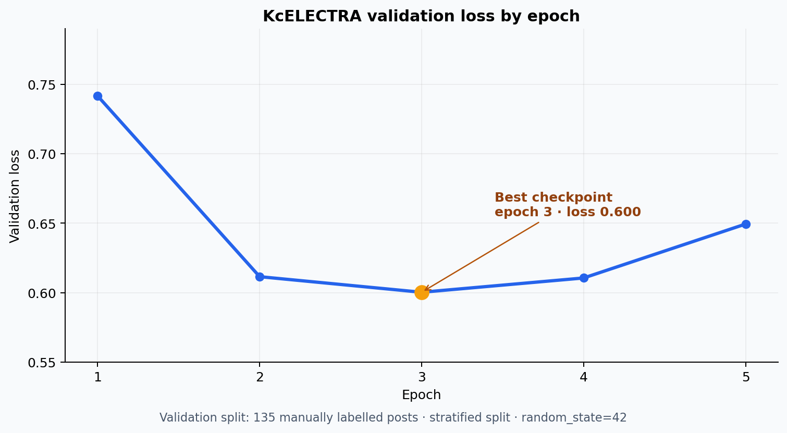

# 분석 근거와 적용 범위

이 문서는 학술제 발표자료·노트북·HTML 산출물을 연결해 프로젝트의 분석 근거와 적용 범위를 설명합니다. 발표에서 제시한 문제의식, 분석 흐름과 제도 제안을 중심에 두고 각 결과가 어떤 의사결정을 지원하는지 정리했습니다.

## 공개 근거 지도

| 주장 | 공개 근거 | 확인 범위 |
|---|---|---|
| 게시글 7,255건 수집 | `구해줘_잡스.pdf` 10쪽 | 2024년 5월–2025년 5월, 본문·댓글·반응 변수 |
| 학내 설문 75명 | 발표자료 5쪽 | 경영경제대학 재학생 편의 표본 |
| 스트레스 3점 이상 85.4% | 발표자료 6쪽의 5점 분포 | 문항별 유효 응답 수는 공개 자료에 별도 표기 없음 |
| 프로그램 미참여 62.7% | 발표자료 8쪽 | 전체 설문 75명 기준 47명으로 해석 가능 |
| 공채 시즌 부정 글 정점 | 발표자료 14쪽 | 월별 부정 게시글 수의 기술 통계 |
| 인기 글의 부정 강도 차이 | 발표자료 15쪽 | 일반 0.386, 상위 10% 0.475, t=2.202, p=.031 |
| 부정 게시글 4토픽 | 발표자료 17쪽·`02_부정_토픽_모델링.ipynb` | scikit-learn LDA 4토픽 키워드 |
| 4개 지원 수요 유형 | 발표자료 18쪽 | 토픽 분포와 부정 강도 기반 K-means 시각화 |

집계값은 [`data/derived/reported_evidence.json`](../data/derived/reported_evidence.json)에 구조화했습니다. 원문 게시글이나 설문 응답을 역추정할 수 있는 정보는 포함하지 않았습니다.

## 감정 분류 모델

`03_감정_분류.ipynb`에 남아 있는 실행 결과는 다음과 같습니다.

- 수동 라벨 데이터: 중복·결측 제거 후 672건
- 학습/검증: 537 / 135건, 클래스 층화, `random_state=42`
- 모델: `beomi/KcELECTRA-base-v2022`, 3-class sequence classification
- 학습: 5 epoch, learning rate `2e-5`, weight decay `0.01`
- 검증 loss: epoch 1 `0.742`, 2 `0.612`, 3 `0.600`, 4 `0.611`, 5 `0.649`

검증 loss는 1–3 epoch 동안 `0.742 → 0.612 → 0.600`으로 개선됐고 이후 `0.611`, `0.649`로 소폭 상승했습니다. 이에 따라 3 epoch 체크포인트를 선택한 것은 검증셋 오차가 가장 낮은 시점을 택한 결정이며, 학습을 더 이어가기보다 일반화 성능을 우선한 선택으로 해석할 수 있습니다.

분류기의 평가는 다음 지표와 절차를 함께 사용하는 체계로 설계합니다.

1. 고정된 검증 또는 독립 테스트셋에서 Accuracy와 Macro-F1 동시 보고
2. 클래스별 precision·recall·F1과 confusion matrix로 오류 방향 확인
3. 부정 클래스를 긍정·중립으로 분류한 사례의 정성 검토
4. 라벨러 2인 이상의 합치도와 데이터 중복·유사 문장 점검
5. 운영 시점에는 월별 클래스 비율과 calibration 안정성 모니터링

공개 집계 기록인 `data/derived/reported_evidence.json`에 보존된 최종 KcELECTRA 성능 근거는 validation loss 중심입니다. 원문이 담긴 기존 노트북의 출력은 제거했습니다. 검증 예측값 또는 학습 체크포인트가 확보되면 [`scripts/evaluate_sentiment.py`](../scripts/evaluate_sentiment.py)로 Accuracy, Macro-F1, 클래스별 지표와 confusion matrix를 같은 기준에서 생성할 수 있습니다. 확인되지 않은 분류 지표를 loss에서 역산하지 않고, 보존된 결과와 재계산 가능한 평가 절차를 구분했습니다.

## 토픽 모델링 버전

최종 발표의 네 토픽은 `02_부정_토픽_모델링.ipynb`의 scikit-learn `LatentDirichletAllocation(n_components=4, random_state=42)` 구성과 당시 공개 집계 기록에 근거합니다.

`reports/부정_토픽_모델링_시각화.html`은 같은 노트북에서 비교한 Gensim `num_topics=3` 탐색 결과입니다. 최종 결과는 coherence와 해석 가능성을 함께 고려한 4토픽 scikit-learn LDA이며, HTML은 토픽 수를 탐색한 작업 과정으로 보존했습니다. BERTopic 결과까지 비교한 뒤 이 데이터에서는 최종 4토픽 LDA가 지원 수요를 설명하는 데 가장 적합하다고 판단했습니다.

## 군집 해석

발표에서는 4차원 토픽 확률과 부정 강도를 결합해 K-means 4개 군집을 시각화했습니다. 이 네 군집은 학생 개인의 성향을 고정적으로 판정하는 분류기가 아니라, 게시글에서 드러난 고민을 프로그램 설계로 연결하는 **지원 수요 유형**입니다. 현실 불안·경쟁 민감·피로 공감·준비 좌절이라는 구분을 통해 동일한 취업 스트레스에도 정보 제공, 1:1 케어, 공감·상담, 경험 보강처럼 서로 다른 개입이 필요하다는 점을 제안했습니다.

운영에 적용할 때는 feature scaling, 군집별 표본 수와 중심값을 명시하고 여러 seed의 안정성·silhouette score·학생 인터뷰를 함께 확인하는 방식으로 유형의 실용성을 평가합니다.

## 통계 결과의 해석

인기 상위 10% 글과 일반 글의 평균 부정 강도 차이는 통계적으로 관측됐지만 글 길이·댓글 수·게시 시점·주제 구성·감정 모델 오차·동일 사용자의 반복 작성을 통제하지 않았습니다. 따라서 “부정적인 글이라서 인기를 얻었다”는 인과 해석 대신 “반응이 큰 글에서 더 높은 부정 강도가 함께 관측됐다”고 표현합니다.

월별 결과 역시 부정 글의 **빈도**입니다. 월별 전체 게시글 수를 분모로 둔 부정 비율이 아니므로 커뮤니티 이용량 변화와 분리해 해석할 수 없습니다.

## 개인정보와 운영 안전

- 원문 텍스트와 설문 응답은 저장소에서 제외합니다.
- 예시는 실제 게시글을 그대로 인용하지 않고 재구성 문장만 사용합니다.
- 게시글 단위 점수를 개인 단위 추적이나 심리 상태 진단에 사용하지 않습니다.
- AI 챗봇은 정보 탐색·상담 연결 역할로 한정하고 위기 대응은 전문 기관으로 연결합니다.
